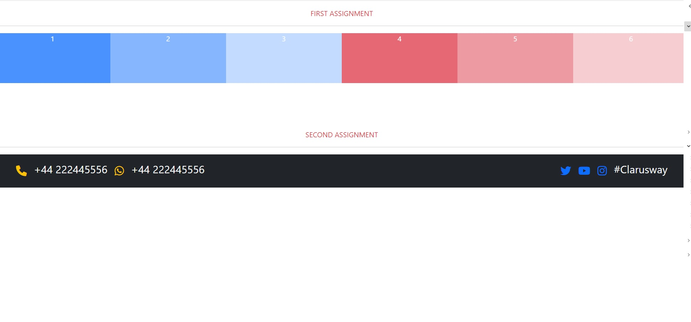
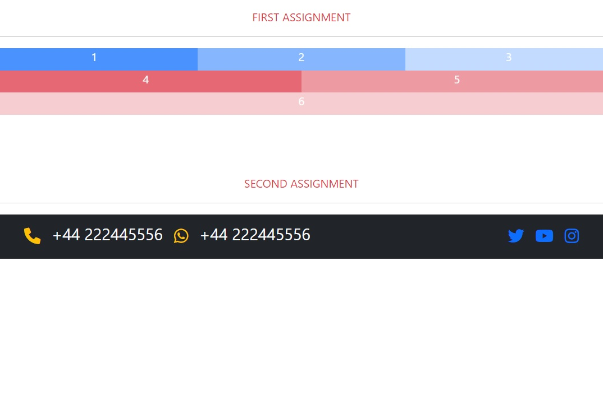
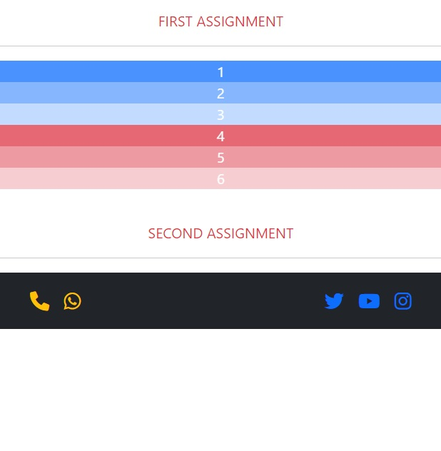

## BOOTSTRAP PRACTICE

Purpose of the this section is to create HTML by using BOOTSTRAP which is front-end framework.

🔗 To see live version 🎯https://tal58.github.io/Bootstrap_Workshop/1.practice/

 ⌛ Happy Coding  ✍ 

## 🖥️Screen version
 

